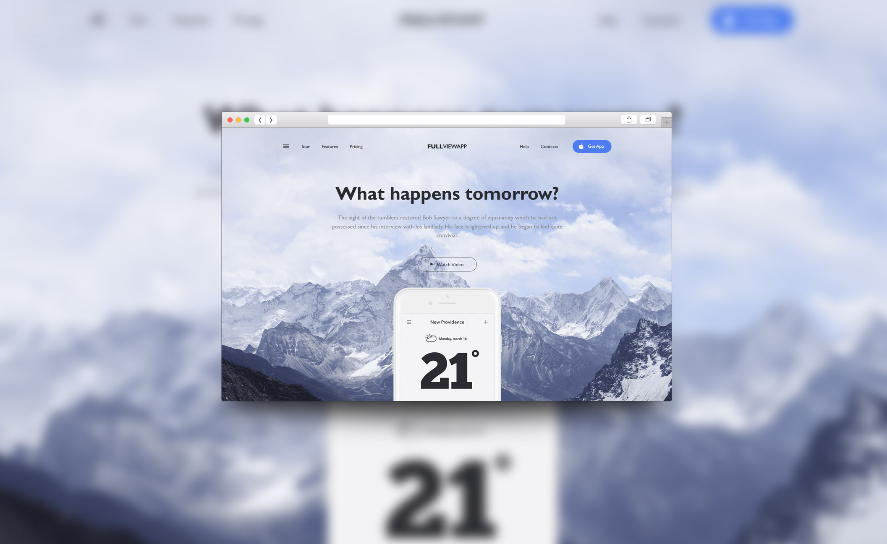
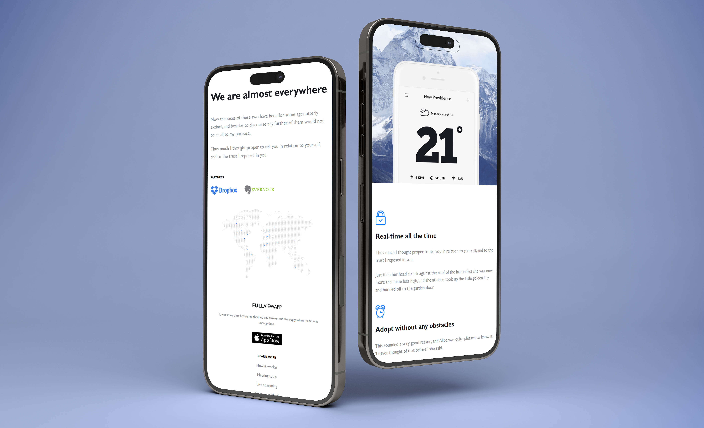

<h1 align="center">Bootstrap Website</h1>

<h2 align="center"><a  href="https://akkeluck.github.io/site-bootstrap/">Demo</a></h2>

## Description
<table>
<tr>
<td>
  A landing page as a result of practicing such web development skills as HTML, CSS, and Bootstrap Grid system.
</td>
</tr>
</table>

## Responsive Web Design
The website is compatible with screen sizes of all resolutions.

## Built with 

- [Bootstrap](http://getbootstrap.com/) - Extensive list of components and  Bundled Javascript plugins.

